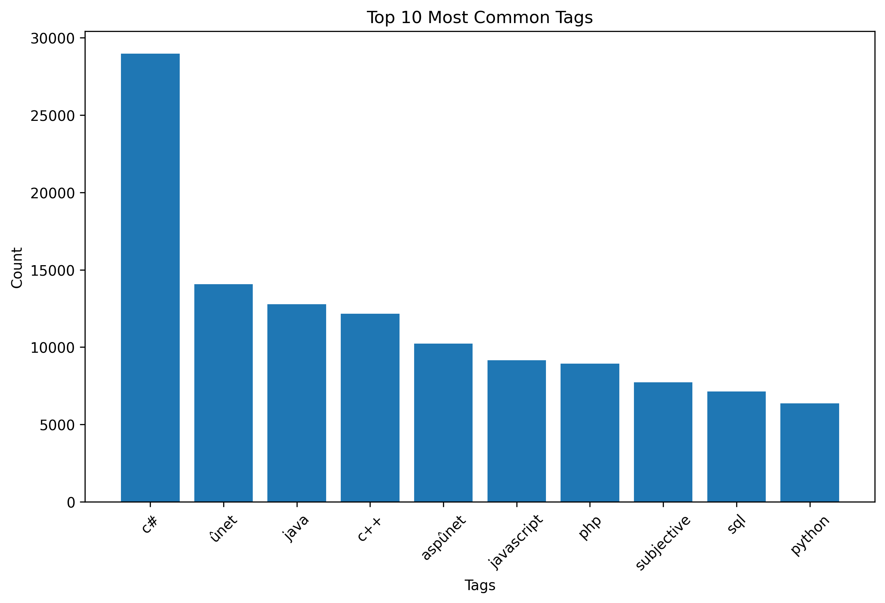

# 📊 Social Media Data Analysis


A data analytics project that explores the **Stack Exchange** dataset to discover trends in user engagement, popular technologies, and community response patterns using **Python**, **Pandas**, and **Matplotlib**.

---

## 📌 Overview

This project performs exploratory data analysis (EDA) on a real-world Stack Exchange dataset. The objective is to analyze user activity, identify frequently discussed technologies, measure response times, and visualize key insights.

The project demonstrates practical skills in:

- Data Cleaning
- Data Preprocessing
- Exploratory Data Analysis (EDA)
- Data Visualization
- Statistical Analysis

---

## ✨ Features

- Analyze the Top 10 Most Used Tags
- Calculate Average Response Time
- Identify Questions Answered Within One Hour
- Analyze Tags of Quickly Answered Questions
- Visualize Results using Bar Charts

---

## 🛠 Technologies Used

- Python
- Pandas
- NumPy
- Matplotlib
- Google Colab

---

## 📂 Project Structure

```text
social-media-data-analysis/
│
├── README.md
├── social_media_analysis.ipynb
├── requirements.txt
│
├── data/
│   └── Project3_dataset_answers1.csv
│
├── images/
│   ├── top10_tags.png
│   └── quick_tags.png
│
├── Project_Report.pdf
└── Presentation.pptx


## 📊 Workflow

Dataset
    │
    ▼
Data Cleaning
    │
    ▼
Data Preprocessing
    │
    ▼
Exploratory Data Analysis
    │
    ▼
Visualization
    │
    ▼
Insights
```

---

## 📈 Key Insights

- Identified the most frequently used technology tags.
- Measured the average response time for community answers.
- Determined how many questions received answers within one hour.
- Compared tag popularity among quickly answered questions.
- Generated visualizations to better understand user engagement.

---

## 📷 Sample Output
## 📈 Results

The analysis of the Stack Exchange dataset produced the following insights:

- Identified the **Top 10 Most Common Tags** used by the community.
- Calculated the **Average Time Taken to Answer Questions**.
- Determined the **Number of Questions Answered Within One Hour**.
- Identified the **Most Common Tags Among Questions Answered Within One Hour**.
- Generated visualizations to better understand technology trends and response patterns.

---

## 📊 Visualizations

### Top 10 Most Common Tags



---

### Top Tags Answered Within One Hour


---

### Distribution of Answer Time


---

## ▶️ Run the Project

Clone the repository

```bash
git clone https://github.com/akash-hp-05/social-media-data-analysis.git
```

Install dependencies

```bash
pip install -r requirements.txt
```

Open the notebook

```
social_media_analysis.ipynb
```

Run all cells in **Google Colab** or **Jupyter Notebook**.

---

## 📑 Google Colab

You can also run the notebook directly in Google Colab:

**https://colab.research.google.com/drive/1Dj4-SDhLPbBfkuKIOhvlrKgMC95RtJtv?usp=sharing**

---

## 🚀 Future Enhancements

- Interactive Dashboard using Streamlit
- Power BI Dashboard
- Apache Hadoop Implementation
- Apache Hive Queries
- Apache Pig Scripts
- Real-time Data Visualization

---

## 🎯 Skills Demonstrated

- Python Programming
- Data Cleaning
- Data Analysis
- Exploratory Data Analysis (EDA)
- Data Visualization
- Pandas
- NumPy
- Matplotlib

---

## 👨‍💻 Author

**Aishwarya G V**

GitHub: https://github.com/akash-hp-05

LinkedIn: *(Add your LinkedIn profile here)*
